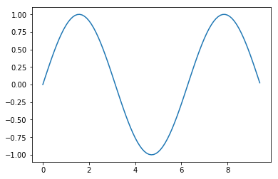
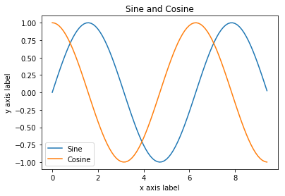

# CS231n Python Numpy 튜토리얼
#### Assignment 1: Korea University COSE474 Deep Learning

이 과제는 스탠포드 대학 `CS231n` 강좌의 첫번째 숙제인 Python Numpy Tutorial(http://cs231n.github.io/python-numpy-tutorial/) 을 Jupyter Notebook으로 옮기고, 직접 번역한 것입니다.

## 들어가며

파이썬은 그 자체만으로도 훌륭한 범용 프로그래밍 언어이지만, 몇 가지 인기있는 라이브러리들(numpy, scipy, matplotlib)의 도움을 받으면 과학적인 컴퓨팅을 위한 강력한 도구가 됩니다.

우리는 여러분들이 파이썬과 numpy에 대한 경험이 있을 것이라 생각합니다. 그렇지 않은 분들께는, 이 섹션은 '파이썬 프로그래밍 언어'와 '과학적인 컴퓨팅을 위한 파이썬의 이용'에 대한 속성 과정을 제공할 것입니다.

여러분 중 일부는 Matlab에 대한 사전 지식이 있을 수도 있겠죠. 이 경우, 우리는 Matlab 사용자 페이지의 numpy 또한 추천합니다(https://docs.scipy.org/doc/numpy-dev/user/numpy-for-matlab-users.html).

이 튜토리얼에서, 우리는 다음을 다룰 것입니다:

* 기초 파이썬: 기본적인 자료형(컨테이너, 리스트, 사전, 집합, 튜플), 함수, 클래스
* Numpy: 배열, 배열 인덱싱, 자료형, 배열 수학, 브로드캐스팅
* Matplotlib: 그리기(Plotting), 서브플롯(Subplots), 이미지
* IPython: 노트북 만들기, 일반적인 워크플로우

## 파이썬의 기초

파이썬은 고급, 동적화된 멀티파라다임 프로그래밍 언어입니다. 파이썬 코드는 매우 가독성이 높으면서도 짧은 코드로 강력한 아이디어를 표현할 수 있기 때문에, 많은 사람들이 의사 코드(pseudocode)와 유사하다고 말합니다. 예를 들어, 다음은 파이썬에서 고전적인 퀵 정렬 알고리즘을 구현한 것입니다:


```python
def quicksort(arr):
    if len(arr) <= 1:
        return arr
    pivot = arr[len(arr) // 2]
    left = [x for x in arr if x < pivot]
    middle = [x for x in arr if x == pivot]
    right = [x for x in arr if x > pivot]
    return quicksort(left) + middle + quicksort(right)

print(quicksort([3,6,8,10,1,2,1]))
```

    [1, 1, 2, 3, 6, 8, 10]


### 파이썬 버젼들

현재 Python 2.7과 3.7의 지원되는 두 가지 버전이 있습니다. 다소 혼란스럽게도 Python 3.x은 많은 하위 호환성이 없는 변경 사항을 도입했기 때문에, 2.7 용으로 작성된 코드는 3.7에서 작동하지 않을 수 있으며 그 반대도 마찬가지입니다. `CS231n`에서는 Python 2.7을 사용하지만, 번역본의 모든 코드는 Python 3.7을 사용하겠습니다.

여러분의 파이썬 버전은 커맨드 라인에서 `python --version`을 실행하여 확인할 수 있습니다.

### 기본적인 자료형

#### 숫자

정수와 부동소수점은 다른 프로그래밍 언어와 같이 동작합니다:


```python
x = 3
print(x, type(x))
```

    3 <class 'int'>


```python
print(x + 1)   # 덧셈
print(x - 1)  # 뺄셈
print(x * 2)   # 곱셈
print(x ** 2)  # 거듭제곱
```

    4
    2
    6
    9


```python
x += 1
print(x)  # "4"를 출력
x *= 2
print(x)  # "8"을 출력
```

    4
    8


```python
y = 2.5
print(type(y)) # "<class 'float'>"을 출력
print(y, y + 1, y * 2, y ** 2) # "2.5 3.5 5.0 6.25"을 출력
```

    <class 'float'>
    2.5 3.5 5.0 6.25


많은 언어와 달리 파이썬에는 단항 증가 (x++) 또는 감소 (x--) 연산자가 없다는 것에 유의하세요.

파이썬에는 또한 긴 정수와 복소수를 위한 내장 형(type)도 있습니다. [문서](https://docs.python.org/3.7/library/stdtypes.html#numeric-types-int-float-long-complex)에서 모든 세부 사항을 찾을 수 있습니다.

#### 부울 함수

파이썬은 부울 논리에 대한 일반적인 연산자를 모두 구현하지만, 기호 (`&&`, `||` 등)보다는 영어 단어를 사용합니다.


```python
t, f = True, False
print(type(t)) # "<class 'bool'>" 출력
```

    <class 'bool'>


자, 연산을 살펴볼까요?


```python
print(t and f) # 논리 AND;
print(t or f)  # 논리 OR;
print(not t)   # 논리 NOT;
print(t != f)  # 논리 XOR;
```

    False
    True
    False
    True


#### 문자열


```python
hello = 'hello'   # 문자열 리터럴은 작은 따음표로 표기 가능합니다.
world = "world"   # 쌍따옴표로도요. 상관 없습니다. 
print(hello, len(hello))
```

    hello 5


```python
hw = hello + ' ' + world  # 문자열 결합
print(hw) # "hello world" 출력
```

    hello world


```python
hw12 = '%s %s %d' % (hello, world, 12)  # sprintf 스타일 문자열 서식
print(hw12)  # "hello world 12" 출력
```

    hello world 12


문자열에는 수많은 유용한 메소드가 있습니다. 예를 들자면:


```python
s = "hello"
print(s.capitalize())  # 문자열을 대문자로; "Hello"를 출력합니다.
print(s.upper())       # 문자열을 대문자로 변환합니다. "HELLO"를 출력합니다.
print(s.rjust(7))      # 문자열의 왼쪽을 공백으로 채워 오른쪽 정렬합니다. "  hello"를 출력합니다.
print(s.center(7))     # 문자열을 가운데 정렬하고, 양쪽을 공백으로 채웁니다. " hello "를 출력합니다.
print(s.replace('l', '(ell)'))  # 한 하위 문자열의 모든 인스턴스를 다른 하위 문자열로 바꿉니다;
                               # "he(ell)(ell)o"를 출력합니다.
print('  world '.strip())  # 선행 공백과 후행 공백을 제거합니다. "world"를 출력합니다.
```

    Hello
    HELLO
      hello
     hello 
    he(ell)(ell)o
    world


[문서](https://docs.python.org/3.7/library/string.html?highlight=string#module-string)에서 모든 스트링 메소드의 쓰임새를 알 수 있습니다.

### 컨테이너

파이썬에는 리스트, 사전, 집합 및 튜플과 같은 몇 가지 기본 제공 컨테이너 유형이 포함되어 있습니다.

#### 리스트

리스트는 파이썬에서 배열과 같은 것이지만, 크기를 조정할 수 있고 다른 유형(type)의 요소를 포함 할 수 있습니다.


```python
xs = [3, 1, 2]   # 리스트 생성
print(xs, xs[2])
print(xs[-1]) # 맨 뒤에 있는 원소 2를 출력합니다.     
```

    [3, 1, 2] 2
    2


```python
xs[2] = 'foo'    # 리스트는 다른 유형(type)의 요소를 포함 할 수 있습니다.
print(xs)
```

    [3, 1, 'foo']


```python
xs.append('bar') # 리스트 끝에 새로운 원소 추가하기
print(xs)  
```

    [3, 1, 'foo', 'bar']


```python
x = xs.pop()     #리스트 마지막 원소 제거하고, 해당 원소 가져오기
print(x, xs)
```

    bar [3, 1, 'foo']


역시나, [문서](https://docs.python.org/3.7/tutorial/datastructures.html#more-on-lists)에서 리스트에 대한 모든 세부 정보를 찾을 수 있습니다.

#### 자르기(Slicing)

한 번에 하나씩 리스트 요소에 접근하는 것 외에도, Python은 하위 요소에 접근하기 위한 간결한 구문을 제공합니다. 이것은 자르기(Slicing)으로 알려져 있습니다 :


```python
nums = list(range(5))    # range는 정수 목록을 만드는 내장 함수입니다.
print(nums)         # "[0, 1, 2, 3, 4]"를 출력
print(nums[2:4])    # 인덱스 2에서 3까지의 조각을 얻는다. "[2, 3]"을 출력합니다.
print(nums[2:])     # 인덱스 2에서 끝까지 조각을 얻습니다. "[2, 3, 4]"를 출력합니다.
print(nums[:2])     # 인덱스 1까지 조각을 가져옵니다. "[0, 1]"을 출력합니다.
print(nums[:])      # 전체 리스트의 조각을 얻습니다. "["0, 1, 2, 3, 4]"를 출력합니다.
print(nums[:-1])    # 조각 인덱스는 음수 일 수 있습니다. "[ "0, 1, 2, 3]" 출력합니다.
nums[2:4] = [8, 9] # 조각에 새 하위 목록 할당
print(nums)         # "[0, 1, 8, 9, 4]"를 출력
```

    [0, 1, 2, 3, 4]
    [2, 3]
    [2, 3, 4]
    [0, 1]
    [0, 1, 2, 3, 4]
    [0, 1, 2, 3]
    [0, 1, 8, 9, 4]


#### 반복문

아래와 같이 리스트의 원소에 loop하며 접근할 수 있습니다.


```python
animals = ['cat', 'dog', 'monkey']
for animal in animals:
    print(animal)
```

    cat
    dog
    monkey


루프 본문의 각 요소 인덱스에 접근하려면 내장된`enumerate` 함수를 사용하세요.


```python
animals = ['cat', 'dog', 'monkey']
for idx, animal in enumerate(animals):
    print('#{}: {}'.format(idx + 1, animal))
```

    #1: cat
    #2: dog
    #3: monkey


#### List comprehensions

프로그래밍 할 때 종종 우리들은 한 유형의 데이터를 다른 유형으로 변환하려고 합니다. 간단한 예로, 제곱 값을 계산하는 다음 코드를 생각해보세요.


```python
nums = [0, 1, 2, 3, 4]
squares = []
for x in nums:
    squares.append(x ** 2)
print(squares)
```

    [0, 1, 4, 9, 16]


이 코드는 list comprehension를 사용한다면 더욱 간략하게 만들 수 있습니다.


```python
nums = [0, 1, 2, 3, 4]
squares = [x ** 2 for x in nums]
print(squares)
```

    [0, 1, 4, 9, 16]


List comprehensions은 또한 조건문을 포함할 수 있습니다.


```python
nums = [0, 1, 2, 3, 4]
even_squares = [x ** 2 for x in nums if x % 2 == 0]
print(even_squares)
```

    [0, 4, 16]


#### 사전(딕셔너리)

사전(딕셔너리)은 자바의`Map`이나 자바스크립트의 객체와 비슷한 (키, 값) 쌍을 저장합니다. 다음과 같이 사용할 수 있습니다.


```python
d = {'cat': 'cute', 'dog': 'furry'}  # 일부 데이터로 새 사전 만들기
print(d['cat'])       # 사전에서 항목을 가져옵니다. "cute" 출력
print('cat' in d)     # 사전이 주어진 키가 있는지 확인합니다. "True" 출력.
```

    cute
    True


```python
d['fish'] = 'wet'    # 사전에 항목 설정
print(d['fish'])      # "wet" 출력
```

    wet


```python
print(d['monkey'])  # KeyError: 'monkey'는 d의 키가 아닙니다.
```


    ---------------------------------------------------------------------------
    
    KeyError                                  Traceback (most recent call last)
    
    <ipython-input-35-6158e158638e> in <module>()
    ----> 1 print(d['monkey'])  # KeyError: 'monkey'는 d의 키가 아닙니다.


    KeyError: 'monkey'


```python
print(d.get('monkey', 'N/A'))  # 키가 해당 d에 없으면 'N/A'를 출력하고,
print(d.get('fish', 'N/A'))    # 있다면 해당 값을 출력합니다.
```

    N/A
    wet


```python
del d['fish']        # 사전에서 요소 삭제
print(d.get('fish', 'N/A')) # "fish"는 더 이상 키가 아닙니다; "N/A" 출력
```

    N/A


[문서](https://docs.python.org/3.7/library/stdtypes.html#dict)에서 사전에 대해 알아야 할 모든 것을 찾을 수 있습니다.

사전의 키를 iterate하는 것은 쉽습니다.


```python
d = {'person': 2, 'cat': 4, 'spider': 8}
for animal in d:
    legs = d[animal]
    print('A %s has %d legs' % (animal, legs))
```

    A person has 2 legs
    A cat has 4 legs
    A spider has 8 legs


키와 해당 값에 액세스하려면 items 메소드를 사용하십시오.


```python
d = {'person': 2, 'cat': 4, 'spider': 8}
for animal, legs in d.items():
    print('A %s has %d legs' % (animal, legs))
```

    A person has 2 legs
    A cat has 4 legs
    A spider has 8 legs


Dictionary comprehensions은 list comprehensions과 비슷하지만 사전을 쉽게 만들 수 있게 해줍니다. 예를 들면,


```python
nums = [0, 1, 2, 3, 4]
even_num_to_square = {x: x ** 2 for x in nums if x % 2 == 0}
print(even_num_to_square)
```

    {0: 0, 2: 4, 4: 16}


#### 집합

집합은 고유 한 요소의 정렬되지 않은 콜렉션입니다. 간단한 예로 다음을 고려하십시오.


```python
animals = {'cat', 'dog'}
print('cat' in animals)   # 요소가 집합의 원소인지 판정합니다.
print('fish' in animals)  
```

    True
    False


```python
animals.add('fish')      # 집합에 원소 추가.
print('fish' in animals)
print(len(animals))       # 집합 원소 개수 출력.
```

    True
    3


```python
animals.add('cat')       # 집합에 기존에 있던 원소를 또 추가하는 것은 의미가 없습니다.
print(len(animals))       
animals.remove('cat')    # 집합에서 원소를 제거합니다.
print(len(animals))       
```

    3
    2


_반복문_ : 집합을 반복하는 것은 목록을 반복하는 것과 동일한 구문을 사용합니다. 그러나 집합은 순서가 지정되지 않으므로 집합의 요소를 방문하는 순서에 대해 가정 할 수 없습니다.


```python
animals = {'cat', 'dog', 'fish'}
for idx, animal in enumerate(animals):
    print('#%d: %s' % (idx + 1, animal))
# "#1: fish", "#2: dog", "#3: cat" 출력
```

    #1: dog
    #2: cat
    #3: fish


Set comprehensions: 리스트와 사전과 같이 set comprehensions을 이용해 집합을 쉽게 만들 수 있습니다.


```python
from math import sqrt
print({int(sqrt(x)) for x in range(30)})
```

    {0, 1, 2, 3, 4, 5}


#### 튜플

튜플은 정렬된 값의 (불변) 리스트입니다. 튜플은 여러 면에서 리스트와 유사합니다. 가장 중요한 차이점 중 하나는 튜플을 사전의 키로 사용할 수 있고 집합의 원소로도 사용할 수 있다는 것입니다. 다음은 간단한 예입니다.


```python
d = {(x, x + 1): x for x in range(10)}  # 튜플 키로 사전 만들기
t = (5, 6)       # 튜플 생성
print(type(t))
print(d[t])       
print(d[(1, 2)])
```

    <class 'tuple'>
    5
    1


```python
t[0] = 1
```


    ---------------------------------------------------------------------------
    
    TypeError                                 Traceback (most recent call last)
    
    <ipython-input-47-c8aeb8cd20ae> in <module>()
    ----> 1 t[0] = 1


    TypeError: 'tuple' object does not support item assignment


### 함수

파이썬 함수는 `def`키워드를 사용해서 정의됩니다.


```python
def sign(x):
    if x > 0:
        return 'positive'
    elif x < 0:
        return 'negative'
    else:
        return 'zero'

for x in [-1, 0, 1]:
    print(sign(x))
```

    negative
    zero
    positive


다음과 같이 선택적 키워드 인수를 취하는 함수를 자주 정의할 것입니다.


```python
def hello(name, loud=False):
    if loud:
        print('HELLO, %s' % name.upper())
    else:
        print('Hello, %s!' % name)

hello('Bob')
hello('Fred', loud=True)
```

    Hello, Bob!
    HELLO, FRED


### 클래스

파이썬에서 클래스를 정의하는 문법은 직관적입니다.


```python
class Greeter:

    # Constructor
    def __init__(self, name):
        self.name = name  # 인스턴스 변수 생성

    # 인스턴스 메소드
    def greet(self, loud=False):
        if loud:
            print('HELLO, %s!' % self.name.upper())
        else:
            print('Hello, %s' % self.name)

g = Greeter('Fred')  # Greeter클래스의 인스턴스 생성
g.greet()            # 인스턴스 메소드 호출; "Hello, Fred" 출력
g.greet(loud=True)   # 인스턴스 메소드 호출; "HELLO, FRED!" 출력
```

    Hello, Fred
    HELLO, FRED!


## Numpy

Numpy는 Python 과학 컴퓨팅을위한 핵심 라이브러리입니다. 고성능 다차원 배열 객체와 이러한 배열 작업을위한 도구를 제공합니다. 이미 MATLAB에 익숙하다면 Numpy를 시작하는 데 유용한 [튜토리얼](http://wiki.scipy.org/NumPy_for_Matlab_Users)을 찾을 수 있습니다.

Numpy를 쓰기 위해선, 먼저 `numpy` 패키지를 import해야 합니다.


```python
import numpy as np
```

### 배열

numpy 배열은 모두 같은 유형의 값 그리드이며, 음수가 아닌 정수의 튜플에 의해 인덱싱됩니다. 차원의 수는 배열의 순위입니다. 배열의 모양(shape)은 각 차원을 따라 배열의 크기를 제공하는 정수의 튜플입니다.

우리는 중첩된 파이썬 리스트로부터 numpy 배열을 초기화 할 수 있고, 대괄호를 사용하여 요소에 접근할 수 있습니다.


```python
a = np.array([1, 2, 3])  # rank 1 배열 생성
print(type(a), a.shape, a[0], a[1], a[2])
a[0] = 5                 # 배열의 원소 변경
print(a)                  
```

    <class 'numpy.ndarray'> (3,) 1 2 3
    [5 2 3]


```python
b = np.array([[1,2,3],[4,5,6]])   # rank 2 배열 생성
print(b)
```

    [[1 2 3]
     [4 5 6]]


```python
print(b.shape)                   
print(b[0, 0], b[0, 1], b[1, 0])
```

    (2, 3)
    1 2 4


Numpy는 또한 배열을 만들기 위한 여러 함수를 제공합니다.


```python
a = np.zeros((2,2))  # 모든 원소가 0인 배열생성
print(a)
```

    [[0. 0.]
     [0. 0.]]


```python
b = np.ones((1,2))   # 모든 원소가 1인 배열생성
print(b)
```

    [[1. 1.]]


```python
c = np.full((2,2), 7) # 상수 배열 생성
print(c) 
```

    [[7 7]
     [7 7]]


```python
d = np.eye(2)        # 2x2 항등행렬 생성
print(d)
```

    [[1. 0.]
     [0. 1.]]


```python
e = np.random.rand(2, 2) # 랜덤 배열 생성
print(e)
```

    [[0.73776253 0.11655513]
     [0.03503918 0.44033052]]


### 배열 인덱싱

Numpy는 배열에 색인을 생성하는 몇 가지 방법을 제공합니다.

잘라내기(Slicing) : 파이썬 리스트와 마찬가지로, numpy 배열은 슬라이스 할 수 있습니다. 배열은 다차원일 수 있으므로 배열의 각 차원에 대해 조각을 지정해야합니다.


```python
import numpy as np

# (3, 4) 모양의 rank 2 배열을 생성합니다. 
# [[ 1  2  3  4]
#  [ 5  6  7  8]
#  [ 9 10 11 12]]
a = np.array([[1,2,3,4], [5,6,7,8], [9,10,11,12]])

# 슬라이싱을 사용하여 처음 2열과 1,2행으로 구성된 하위 배열을 꺼냅니다.
# b는 (2, 2) 모양의 다음 배열입니다.
# [[2 3]
#  [6 7]]
b = a[:2, 1:3]
print(b)
```

    [[2 3]
     [6 7]]


배열의 조각은 동일한 데이터에 대한 거울과 같으므로, 수정하면 원래 배열이 수정됩니다.


```python
print(a[0, 1])  
b[0, 0] = 77    # b[0, 0]는 a[0, 1]와 같은 데이터입니다.
print(a[0, 1]) 
```

    2
    77


정수 인덱싱과 슬라이스 인덱싱을 혼용 할 수도 있습니다. 그러나 이렇게하면 원래 배열보다 낮은 rank의 배열이 생성됩니다. 이것은 MATLAB이 배열 슬라이스를 처리하는 방식과 매우 다릅니다.


```python
# (3, 4) 모양의 2 rank 배열을 생성합니다.
a = np.array([[1,2,3,4], [5,6,7,8], [9,10,11,12]])
print(a)
```

    [[ 1  2  3  4]
     [ 5  6  7  8]
     [ 9 10 11 12]]


배열의 중간 행에 있는 데이터에 접근하는 두 가지 방법. 
정수 인덱스와 슬라이스를 섞으면 더 낮은 rank의 배열이 생성되는 반면, 슬라이스만 사용하면 원래 배열과 동일한 rank의 배열이 생성됩니다.


```python
row_r1 = a[1, :]    # a의 두번째 행의 rank 1 view
row_r2 = a[1:2, :]  # a의 두번째 행의 rank 2 view
row_r3 = a[[1], :]  # a의 두번째 행의 rank 2 view
print(row_r1, row_r1.shape)
print(row_r2, row_r2.shape)
print(row_r3, row_r3.shape)
```

    [5 6 7 8] (4,)
    [[5 6 7 8]] (1, 4)
    [[5 6 7 8]] (1, 4)


```python
# 배열에 접근 할 때 동일한 구별을 할 수 있습니다.
col_r1 = a[:, 1]
col_r2 = a[:, 1:2]
print(col_r1, col_r1.shape, end='\n\n')
print(col_r2, col_r2.shape)
```

    [ 2  6 10] (3,)
    
    [[ 2]
     [ 6]
     [10]] (3, 1)


정수 배열 인덱싱 : 슬라이싱을 사용하여 numpy 배열로 인덱싱 할 때 나오는 배열 view는 항상 원래 배열의 하위 배열이됩니다. 반대로 정수 배열 인덱싱을 사용하면 다른 배열의 데이터를 사용하여 임의의 배열을 구성 할 수 있습니다. 다음은 그 예입니다.


```python
a = np.array([[1,2], [3, 4], [5, 6]])

# 정수 배열 인덱싱의 예시
# 반환된 배열은 shape (3,)
print(a[[0, 1, 2], [0, 1, 0]])

# 위의 정수 배열 인덱싱 예제는 다음과 같습니다.
print(np.array([a[0, 0], a[1, 1], a[2, 0]]))
```

    [1 4 5]
    [1 4 5]


```python
# 정수 배열 색인을 사용하는 경우 원본 배열에서 같은 요소를 다시 사용할 수 있습니다.
print(a[[0, 0], [1, 1]])

# 전의 정수 배열 인덱싱 예제와 동일
print(np.array([a[0, 1], a[0, 1]]))
```

    [2 2]
    [2 2]


정수 배열 인덱싱을 사용하는 유용한 트릭은 행렬의 각 행에서 하나의 요소를 선택하거나 변경하는 것입니다.


```python
# 요소를 선택할 새 배열을 생성합니다.
a = np.array([[1,2,3], [4,5,6], [7,8,9], [10, 11, 12]])
print(a)
```

    [[ 1  2  3]
     [ 4  5  6]
     [ 7  8  9]
     [10 11 12]]


```python
# 인덱스로 구성된 배열
b = np.array([0, 2, 0, 1])

# b의 인덱스를 이용해 a의 각 행에서 원소를 추출합니다.
print(a[np.arange(4), b])  # "[ 1  6  7 11]"
```

    [ 1  6  7 11]


```python
# b의 인덱스를 사용하여 a의 각 행에서 하나의 요소를 변경합니다.
a[np.arange(4), b] += 10
print(a)
```

    [[11  2  3]
     [ 4  5 16]
     [17  8  9]
     [10 21 12]]


부울 배열 인덱싱 : 부울 배열 인덱싱을 사용하면 배열의 임의 요소를 선택할 수 있습니다. 이 유형의 인덱싱은 일부 조건을 충족하는 배열 요소를 선택하는 데 자주 사용됩니다. 다음은 그 예입니다.


```python
import numpy as np

a = np.array([[1,2], [3, 4], [5, 6]])

bool_idx = (a > 2)  # 2보다 큰 a의 원소를 찾는다;
                    #이것은 a와 같은 모양의 부울 값 배열을 반환합니다. 
                    #여기서 bool_idx의 각 슬롯은 a의 해당 요소가 2보다 큰지 여부를 나타냅니다.
print(bool_idx)
```

    [[False False]
     [ True  True]
     [ True  True]]


```python
# boolean 배열 인덱싱을 사용하여 bool_idx의 True 값에 해당하는 요소로 구성된 rank 1 배열을 만듭니다.
print(a[bool_idx])

# 우리는 위의 모든 것을 하나의 간결한 문으로 할 수 있습니다.
print(a[a > 2])
```

    [3 4 5 6]
    [3 4 5 6]


간단히 하기 위해 numpy 배열 인덱싱에 대한 많은 세부 사항을 생략했습니다. 더 많은 것을 알고 싶다면 문서를 읽어보세요.

### 자료형

각 열의 배열은 동일한 유형의 요소 그리드입니다. Numpy는 배열을 생성하는 데 사용할 수 있는 다양한 자료형을 제공합니다. Numpy는 배열을 만들 때 자료형을 추측하려고 시도하지만 배열을 생성하는 함수에는 대개 자료형을 명시적으로 지정하는 선택적 인수도 포함됩니다. 다음은 그 예입니다.


```python
x = np.array([1, 2])  # numpy가 자료형 선택하게 하기
y = np.array([1.0, 2.0])  # numpy가 자료형 선택하게 하기
z = np.array([1, 2], dtype=np.int64)  # 특별한 자료형 지정하기

print(x.dtype, y.dtype, z.dtype)
```

    int32 float64 int64


### 배열 수학

기본 수학 함수는 배열에서 요소 단위로 작동하며 연산자 오버로드와 numpy 모듈의 함수로 사용할 수 있습니다.


```python
x = np.array([[1,2],[3,4]], dtype=np.float64)
y = np.array([[5,6],[7,8]], dtype=np.float64)

# 요소끼리의 합; 둘 다 배열을 생성합니다.
print(x + y)
print(np.add(x, y))
```

    [[ 6.  8.]
     [10. 12.]]
    [[ 6.  8.]
     [10. 12.]]


```python
# 요소끼리의 차이; 둘 다 배열을 생성합니다.
print(x - y)
print(np.subtract(x, y))
```

    [[-4. -4.]
     [-4. -4.]]
    [[-4. -4.]
     [-4. -4.]]


```python
# 요소끼리의 곱; 둘 다 배열을 생성합니다.
print(x * y)
print(np.multiply(x, y))
```

    [[ 5. 12.]
     [21. 32.]]
    [[ 5. 12.]
     [21. 32.]]


```python
# 요소끼리의 나눗셈; 둘 다 배열을 생성합니다.
# [[ 0.2         0.33333333]
#  [ 0.42857143  0.5       ]]
print(x / y)
print(np.divide(x, y))
```

    [[0.2        0.33333333]
     [0.42857143 0.5       ]]
    [[0.2        0.33333333]
     [0.42857143 0.5       ]]


```python
# 요소끼리의 제곱근; 둘 다 배열을 생성합니다.
# [[ 1.          1.41421356]
#  [ 1.73205081  2.        ]]
print(np.sqrt(x))
```

    [[1.         1.41421356]
     [1.73205081 2.        ]]


MATLAB과 달리 '*'는 행렬 곱셈이 아닌 요소 별 곱셈이라는 점에 주의하세요. 그 대신 벡터의 내부 곱을 계산하고 벡터에 행렬을 곱하고 행렬을 곱하기 위해 dot 함수를 사용합니다. dot는 numpy 모듈의 함수와 배열 객체의 인스턴스 메서드로 사용할 수 있습니다.


```python
x = np.array([[1,2],[3,4]])
y = np.array([[5,6],[7,8]])

v = np.array([9,10])
w = np.array([11, 12])

# 벡터의 내적; 모두 219을 생성합니다.
print(v.dot(w))
print(np.dot(v, w))
```

    219
    219


```python
# 행렬/벡터 곱; 모두 rank 1 배열 [29 67]을 생성합니다.
print(x.dot(v))
print(np.dot(x, v))
```

    [29 67]
    [29 67]


```python
# 행렬/행렬 곱; 모두 rank 2 배열을 생성합니다.
# [[19 22]
#  [43 50]]
print(x.dot(y))
print(np.dot(x, y))
```

    [[19 22]
     [43 50]]
    [[19 22]
     [43 50]]


Numpy는 배열에서 계산을 수행하는 데 유용한 많은 기능을 제공합니다. 가장 유용한 것 중 하나는`sum`입니다.


```python
x = np.array([[1,2],[3,4]])

print(np.sum(x))  # 모든 원소의 합을 계산; "10"
print(np.sum(x, axis=0))  # 각 열의 합을 계산; "[4 6]"
print(np.sum(x, axis=1))  # 각 행의 합을 계산; "[3 7]"
```

    10
    [4 6]
    [3 7]


Numpy에서 제공하는 수학 함수의 전체 목록은 [문서](http://docs.scipy.org/doc/numpy/reference/routines.math.html)에서 찾을 수 있습니다.

배열을 사용하여 수학 함수를 계산하는 것 외에도 배열의 데이터를 변형하거나 조작해야하는 경우가 자주 있습니다. 이 유형의 연산 중 가장 간단한 예제는 행렬을 전치시키는 것입니다. 행렬을 전치시키려면 그냥 배열 객체의 T 속성을 사용하세요.


```python
print(x)
print(x.T)
```

    [[1 2]
     [3 4]]
    [[1 3]
     [2 4]]


```python
v = np.array([[1,2,3]])
print(v)
print(v.T)
```

    [[1 2 3]]
    [[1]
     [2]
     [3]]


### 브로드캐스팅

브로드캐스팅은 산술 연산을 수행 할 때 numpy가 다른 모양의 배열로 작업 할 수있게 해주는 강력한 메커니즘입니다. 종종 우리는 더 작은 배열과 더 큰 배열을 갖고 있고, 이 때 더 큰 배열에서 어떤 연산을 수행하기 위해 더 작은 배열을 여러 번 사용하려고합니다.

예를 들어, 행렬의 각 행에 상수 벡터를 추가한다고 가정합니다. 우리는 다음과 같이 할 수 있습니다.


```python
# 행렬 x의 각 행에 벡터 v를 더한다.
# 결과를 행렬 y에 저장
x = np.array([[1,2,3], [4,5,6], [7,8,9], [10, 11, 12]])
v = np.array([1, 0, 1])
y = np.empty_like(x)   # x와 같은 형태의 빈 행렬을 생성

# 명백한 루프로 가진 행렬 x의 각 행에 벡터 v를 더한다.
for i in range(4):
    y[i, :] = x[i, :] + v

print(y)
```

    [[ 2  2  4]
     [ 5  5  7]
     [ 8  8 10]
     [11 11 13]]


위 코드는 잘 동작하기는 합니다. 그러나 행렬`x`가 매우 큰 경우, 파이썬에서 명시적 루프를 계산하는 것은 매우 느려질 수 있습니다. 행렬 `x`의 각 행에 벡터 v를 더하는 것은`v`의 수직 배열을 여러 개 겹쳐서 행렬을 만들고 행렬을 구성한 다음, `x`와 `vv`를 원소별로 합하는 것과 같습니다. 이 접근법은 다음과 같이 구현할 수 있습니다.


```python
vv = np.tile(v, (4, 1))  # v의 복사본 4개를 각자 위에 계속 쌓습니다.
print(vv)                #         "[[1 0 1]
                         #          [1 0 1]
                         #          [1 0 1]
                         #          [1 0 1]]"
```

    [[1 0 1]
     [1 0 1]
     [1 0 1]
     [1 0 1]]


```python
y = x + vv  # x와 vv를 원소별로 더합니다.
print(y)
```

    [[ 2  2  4]
     [ 5  5  7]
     [ 8  8 10]
     [11 11 13]]


Numpy 브로드캐스팅은 실제로 여러개의 v의 복사본을 마들지 않고도 이 계산을 실행할 수 있게 해줍니다. 브로드캐스팅을 사용하는 이 버전을 보세요.


```python
import numpy as np

# 행렬 y에 결과를 저장하며 행렬 x의 각 행에 벡터 v를 더할 것입니다.
x = np.array([[1,2,3], [4,5,6], [7,8,9], [10, 11, 12]])
v = np.array([1, 0, 1])
y = x + v  # 브로드캐스팅을 이용해 x의 각 행에 v를 더합니다.
print(y)
```

    [[ 2  2  4]
     [ 5  5  7]
     [ 8  8 10]
     [11 11 13]]


`y = x + v` 행은 `x`의 형태가 `(4, 3)` 이고 `v`가 `(3,)`의 형태를 갖지만 브로드캐스팅 덕분에 계산될 수 있습니다. 이 행은 v가 실제로`(4, 3)`형태를 갖는 것처럼 작동합니다. 여기서 각 행은 `v`의 복사본이고, 합계는 원소 별 합계입니다.

두 개의 배열을 함께 브로드캐스팅하면 다음 규칙이 적용됩니다.

1. 배열의 rank가 같지 않으면, 두 형태가 같은 길이가 될 때까지 하위 rank 배열의 형태에 1을 덧붙입니다.
2. 두 배열은 차원 상 크기가 같거나, 배열 중 하나가 그 차원에서 크기가 1일 경우 '호환 가능하다'고 말합니다.
3. 배열들이 모든 차원에서 호환 가능하면 함께 브로드캐스팅 될 수 있습니다.
4. 브로드캐스팅 후, 각 배열은 두 개의 입력 배열의 원소 별 최대 값의 형태와 동일한 형태를 가진 것처럼 동작합니다.
5. 한 배열의 크기가 1이고 다른 배열의 크기가 1보다 큰 어떠한 차원에서도, 첫 번째 배열은 마치 해당 차원을 따라 복사된 것처럼 작동합니다.

이 설명이 이해가되지 않는다면 [문서](http://docs.scipy.org/doc/numpy/user/basics.broadcasting.html) 또는이 [설명](http://wiki.scipy.org/EricsBroadcastingDoc)에서 설명을 읽으세요.

브로드캐스팅을 지원하는 함수들은 보편 함수로서 알려져 있습니다. [문서](http://docs.scipy.org/doc/numpy/reference/ufuncs.html#available-ufuncs)에서 보편 함수의 모든 목록을 확인할 수 있습니다.방송을 지원하는 기능을 보편적 기능이라고합니다. 

다음은 브로드캐스팅의 일부 응용을 보여줍니다.


```python
# 벡터의 외적 계산
v = np.array([1,2,3])  # v의 형태는 (3,)
w = np.array([4,5])    # w의 형태는 (2,)
# 외적을 계산하기 위해 먼저 v를 shape (3, 1)의 열 벡터로 재구성합니다. 
# w에 대해 그것을 브로드캐스팅하여 v와 w의 외적인 shape (3, 2)의 출력을 산출 할 수 있습니다.
print(np.reshape(v, (3, 1)) * w)
```

    [[ 4  5]
     [ 8 10]
     [12 15]]


```python
# 행렬의 각 행에 벡터 더하기
x = np.array([[1,2,3], [4,5,6]])
# x는 (2, 3)의 형태를 가지며 v는 (3,)의 형태를 가지므로 (2, 3)에 브로드캐스팅되어 다음 행렬을 제공합니다.

print(x + v)
```

    [[2 4 6]
     [5 7 9]]


```python
# 행렬의 각 행에 벡터 더하기
# x는 (2, 3), w는 (2,)의 형태를 지닙니다.
# 만약 x를 전치시킨다면, (3,2)의 형태를 지닐 것이며 w에 브로드캐스팅되어 결과적으로 (3, 2)의 형태를 얻게 됩니다.
# 이 결과를 전치시키는 것은 결과적으로 (2, 3)의 형태를 산출하는데, 이는 행렬 x의 각 열에 벡터 w를 더한 것입니다.
print((x.T + w).T)
```

    [[ 5  6  7]
     [ 9 10 11]]


```python
# 다른 해결책은 w를 (2,1)형태의 행 벡터로 재구성하는 것입니다;
# 이를 x에 직접 브로드캐스트하여, 같은 결과를 얻을 수 있습니다.
print(x + np.reshape(w, (2, 1)))
```

    [[ 5  6  7]
     [ 9 10 11]]


```python
# 행렬에 상수 곱하기:
# x는 (2, 3)의 형태입니다. Numpy는 스칼라 값을 () 형태의 배열로 취급합니다;
# 이들은 브로드캐스트되어 (2,3)의 형태가 되고, 결과적으로 다음 배열을 산출합니다.
print(x * 2)
```

    [[ 2  4  6]
     [ 8 10 12]]


브로드캐스팅은 일반적으로 코드를 보다 간결하고 빠르게 만들므로, 가능하면 이를 사용하려고 노력해야 합니다.

이 간단한 개요는 numpy에 대해 알아야 할 중요한 여러 가지 사항을 다루었지만 완벽하지는 않습니다. numpy에 대해 자세히 알아 보려면 [numpy 참조](http://docs.scipy.org/doc/numpy/reference/)를 확인하십시오.

## Scipy

Numpy는 고성능 다차원 배열과 이러한 배열을 계산하고 조작하기 위한 기본 도구를 제공합니다. SciPy는 이를 기반으로 numpy 배열에서 작동하며, 과학 및 엔지니어링 응용 프로그램의 다른 유형에 유용한 많은 수의 기능을 제공합니다.

SciPy에 익숙해지는 가장 좋은 방법은 문서를 탐색하는 것입니다. 이 수업에 유용하게 사용할 수 있을만한 Scipy의 몇 가지 부분을 소개합니다.

### 이미지 연산
SciPy는 이미지 작업을위한 몇 가지 기본 기능을 제공합니다. 예를 들어 디스크에서 이미지를 numpy 배열로 읽고 numpy 배열을 이미지로 디스크에 쓰고 이미지의 크기를 조정하는 기능이 있습니다. 다음은 이러한 기능을 보여주는 간단한 예입니다.

그러나 최근 Scipy는 이미지 I/O 기능을 사용하지 않습니다. 이 기능을 사용하려면, `imageio` 라이브러리를 사용하세요.


```python
import imageio
from skimage.transform import resize

# JPEG 이미지를 numpy 배열로 읽어오기
img = imageio.imread('assets/cat.jpg')
print(img.dtype, img.shape)  # "uint8 (719, 1280, 3)" 출력

# 서로 다른 스칼라 상수로 각 색상 채널을 스케일링하여 이미지에 색조를 적용 할 수 있습니다. 
# 이미지는 (400, 248, 3) 형태입니다; 이를 (3,) 형태의 배열 [1, 0.95, 0.9]에 곱합니다.
# numpy 브로드캐스팅은 빨간색 채널을 변경하지 않고 녹색 채널과 파란색 채널에 각각 0.95와 0.9를 곱하는 것을 의미합니다.
img_tinted = img * [1, 0.95, 0.9]

# 착색된 이미지의 크기를 300 x 300픽셀로 조정합니다.
img_tinted = resize(img_tinted, (300, 300))

# 착색된 이미지를 디스크에 다시 기록합니다.
imageio.imsave('assets/cat_tinted.jpg', img_tinted)
```

    uint8 (719, 1280, 3)


    C:\Users\korra\Anaconda3\lib\site-packages\skimage\transform\_warps.py:84: UserWarning: The default mode, 'constant', will be changed to 'reflect' in skimage 0.15.
      warn("The default mode, 'constant', will be changed to 'reflect' in "
    C:\Users\korra\Anaconda3\lib\site-packages\imageio\core\util.py:104: UserWarning: Conversion from float64 to uint8, range [0.0, 254.7358333333335]
      'range [{2}, {3}]'.format(dtype_str, out_type.__name__, mi, ma))


## MATLAB 파일
scipy.io.loadmat 및 scipy.io.savemat 함수를 사용하면 MATLAB 파일을 읽고 쓸 수 있습니다. [문서](http://docs.scipy.org/doc/scipy/reference/io.html)에서 자세한 내용을 읽을 수 있습니다.

### 포인트 간 거리
SciPy는 점 집합 사이의 거리를 계산하기위한 몇 가지 유용한 함수를 정의합니다.
scipy.spatial.distance.pdist 함수는 주어진 집합에서 모든 점 쌍 사이의 거리를 계산합니다.


```python
import numpy as np
from scipy.spatial.distance import pdist, squareform

# 각 행이 2D 공간의 점인 다음 배열을 생성합니다.
# [[0 1]
#  [1 0]
#  [2 0]]
x = np.array([[0, 1], [1, 0], [2, 0]])
print(x)

# x의 각 행간 유클리디언 거리를 계산합니다.
# d[i, j]는 x[i, :]와 x[j, :] 사이의 유클리디언 거리이며, d는 다음과 같은 배열입니다.
# [[ 0.          1.41421356  2.23606798]
#  [ 1.41421356  0.          1.        ]
#  [ 2.23606798  1.          0.        ]]
d = squareform(pdist(x, 'euclidean'))
print(d)
```

    [[0 1]
     [1 0]
     [2 0]]
    [[0.         1.41421356 2.23606798]
     [1.41421356 0.         1.        ]
     [2.23606798 1.         0.        ]]


[문서](http://docs.scipy.org/doc/scipy/reference/generated/scipy.spatial.distance.pdist.html)에서 이 함수에 대한 모든 자세한 점을 읽을 수 있습니다.

비슷한 함수(scipy.spatial.distance.cdist)는 두 쌍의 점 사이 모든 짝의 거리를 계산합니다. 역시 [문서](http://docs.scipy.org/doc/scipy/reference/generated/scipy.spatial.distance.cdist.html)에서 확인할 수 있습니다.

## Matplotlib

Matplotlib은 그림, 표를 그리는 라이브러리입니다. 이 섹션에서는 MATLAB과 유사한 플롯팅 시스템을 제공하는`matplotlib.pyplot` 모듈에 대해 간단히 소개합니다.


```python
import matplotlib.pyplot as plt
```

이 특별한 iPython 명령을 실행하면, 우리는 플롯을 인라인으로 표시 할 것입니다.


```python
%matplotlib inline
```

### 그리기(Plotting)

`matplotlib`의 가장 중요한 기능은 2D 데이터를 그릴 수있는 plot입니다. 다음은 간단한 예입니다.


```python
# 사인 곡선상의 점에 대한 x 및 y 좌표 계산
x = np.arange(0, 3 * np.pi, 0.1)
y = np.sin(x)

# matplotlib을 사용해 그리기
plt.plot(x, y)
```


    [<matplotlib.lines.Line2D at 0x1434539b7f0>]





추가 작업을 조금만하면 한 번에 여러 줄을 쉽게 그릴 수 있고 제목, 범례 및 축 레이블을 추가 할 수 있습니다.


```python
y_sin = np.sin(x)
y_cos = np.cos(x)

# matplotlib을 사용해 그리기
plt.plot(x, y_sin)
plt.plot(x, y_cos)
plt.xlabel('x axis label')
plt.ylabel('y axis label')
plt.title('Sine and Cosine')
plt.legend(['Sine', 'Cosine'])
```


    <matplotlib.legend.Legend at 0x14345380f60>





### 서브플롯(Subplots)

subplot 함수를 사용하여 같은 그림에 다른 것들을 그릴 수 있습니다. 다음은 그 예입니다.


```python
# 사인과 코사인 곡선상의 점에 대한 x 및 y 좌표 계산
x = np.arange(0, 3 * np.pi, 0.1)
y_sin = np.sin(x)
y_cos = np.cos(x)

# 높이 2와 너비 1을 지닌 subplot 그리드를 설정하고, 첫번째 subplot을 활성화
plt.subplot(2, 1, 1)

# 첫번째 그림 만들기
plt.plot(x, y_sin)
plt.title('Sine')

# 두번째 subplot을 활성화하고, 두번째 그림 그리기.
plt.subplot(2, 1, 2)
plt.plot(x, y_cos)
plt.title('Cosine')

# 그림을 나타내기.
plt.show()
```


[문서](http://matplotlib.org/api/pyplot_api.html#matplotlib.pyplot.subplot)에서`subplot` 함수에 대해 더 많이 읽을 수 있습니다.
